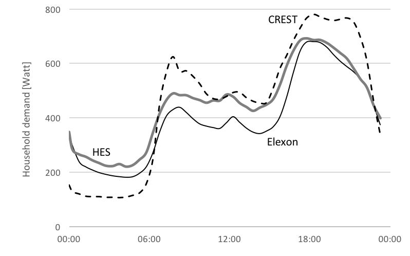

# INTRODUCTION
With the closure of 55% of the UK's fossil fuel capacity over the next decade, the system flexibility, which these plant provide, will be greatly reduced. If less flexible low carbon sources are to take their place, new forms of flexibility are needed.
Interconnections, storage and demand response hold great promise in this area.
 For the UK the potential annual system savings from demand response have been estimated to be in the billions of pounds [1]. The extent to which the 'technical potential' can be realised is not well understood.

In this paper we argue that current models are not well equipped to address this new requirement and that supporting data is still lacking at the required scale.

We explore the status of demand models and identify conceptual shortcomings and data gaps that need to be addressed if we are to better understand demand side flexibility.

##	Changing needs for evidence in the residential sector
¬	From overall demand to flexibility
¬	Any definitions, scope of paper
¬	Literature review (though some of this will sit more neatly in following sections)

# REVIEW OF MODELS AND DATA USED FOR UNDERSTANDING RESIDENTIAL DEMAND
## Taxonomy of residential energy models
Energy models are generally used to explore and explain changes in energy consumption. There are generally two main approaches to modelling energy consumption in the residential sector:  top-down and bottom-up - the terminology referring to the hierarchical level of the data inputs. The use of each depends on the data available and the purpose of the analysis.  Top-down models generally make use of historic sector specific (e.g. residential) time series data of energy consumption and related sector-specific data.  Such top-down models are usually driven by econometric data (such as energy and appliance prices) and technological data (such as autonomous rates of efficiency improvement and ownership rates). On the other hand, bottom-up models require significantly more data at the sub-sector level, and so can account for energy consumption at the regional, individual household or equipment level. Figure 1 shows a simple classification of residential modelling.  [1] [2]

[!Figure1](Figure1)

Bottom up models are usually classified further into two main groups: engineering and statistical. The statistical ones can include regression methods when measured data are available [3], conditional demand analysis and neural networks [4].

However, it is the engineering style of bottom-up model that has, to date, presented the best opportunities to develop a greater understanding of how energy is being used at the sub-sector level, and how user behaviour influences consumption.  A selection of such models is now reviewed.

## Review of selected UK end-use models
We review the historical development of UK residential end-use demand models with the examples of BREHOMES, DECADE, DCM and CREST. This review shows how the demands on these models has changed and increased over time and how analysts have responded by developing new and improved modelling and data collection approaches.

### BREHOMES
BREHOMES is a physically-based residential housing stock model, providing national energy consumption estimates by house type [5]. It requires detailed information on the building type, heating system, internal and external temperatures, etc. Different versions of the underlying BREDEM algorithm support annual consumption (BRDEM-12) or monthly figures (BREDEM-8). This model allows the exploration of technology and policy interventions, especially relating to heating aspects of the home. 

### DECADE

The Domestic equipment and carbon dioxide emissions (DECADE) model advanced the resolution of BREHOMES by separating out lighting and appliances.
 DECADE is a detailed end-use model of energy consumption supporting product policy on mandatory energy labels and minimum energy performance standards. [6,7]
The detailed end-uses include cooking, lighting, water heating, consumer electronics, refrigeration.  Monte Carlo simulations were also undertaken to provide confidence intervals around the point estimates of energy consumption.
The modelling approach was used to show annual energy consumption by end-use, with the primary use being the ex-ante impact assessments of technical potential, variation in usage patterns, and policy options [8, 9]. Similar modelling approaches are used internationally [10].

[XXX we should say more about the inputs to these models: appliance stock / sales figures, tech. specs of these appliances... and what is assumed: usage patterns... and what is not covered: societal distribution (some high, some low...)]

DECADE included first attempts to estimate load curves by end-use, but data supporting data was insufficient at the time and still remains an inhibiting factor in international attempts to adopt this approach [11].

### UKDCM 
The DECADE Modelling was extended to create the UK Domestic Carbon Model (UKDCM) model [12], which extends the differentiation of loads to include space/water heating along with building types, using BREDEM-8 algorithm. Compared to BREHOMES new data on appliances [XXX can we be specific about the data? do we mention it in the 'Data' section? XXX] and lighting could be included, enabling long term technical and policy scenarios to be examined in more detail [13].

[A later UKDCM2 was also generated.  Russel can provide further information? Other similar models which use BREDEM as the underlying physical model (eg DeCARB, Johnson).]

### CREST 
The Centre for Renewable Energy Systems Technology (CREST) model simulates household load profiles with one minute resolution (@Richardson10b). The model has found a wide range of applications, including network constraints analysis. 

Load profiles are generated based on the Markov chain modelling technique, whereby each state is the result of a set of probability distributions resulting from the previous state. A household has a given number of occupants, who have a probability distribution of being 'active occupants', i.e. likely to use certain appliances. The occupancy, and to some extent the activity probabilities, are informed by the UK Time Use survey of 2000 (@Lader06).

The appliance ownership itself is based on probability distributions for 33 common household appliances. [XXX Jose - what is the source of the ownership data? XXX]

The stochastic method results in each model run a produce a unique attempt to produce a 'realistic' load profile.

## Data sources for bottom-up household models
This section summarises some of the key data sources used in bottom-up energy-use models.

### Sales figures and market research
Governments and private organisations collect statistics and information on product sales and their technical characteristics. Australia, U.S.A. and China keep formal registration databases of technologies deployed, which provide robust data for appliance stock models. 
Various countries require energy-using products to be registered centrally before they can be placed in the market to comply with minimum energy performance or labelling requirements. The EU has not yet adopted such a database.

### Physical inspection of homes
Physical surveys of households can provide insights into the ownership of end-use equipment along with physical characteristics of the buildings themselves. Such surveys can be through home visits, such as those used to generate SAP assessments or provide representative national statistics on the housing stock. Governments also collect and collate these through the use of national surveys. For England, the most significant for end-use models is the English Housing Survey (EHS), which is a continuous national survey, commissioned by the Department for Communities and Local Government (DCLG). It collects information about people’s housing circumstances and the condition and energy efficiency of housing in England. In addition to the household interview (next section) it undertakes a physical inspection of a sub-sample of the properties. [list earlier studies, EHCS, etc]. Similar studies are undertaken in other parts of the UK.

### Home surveys
, market research companies also collect useful information from householders, by making use of questionnaires given to large panels (multiple thousands).  For example, the market research GfK has a home audit panel, which can be used to provide very reliable estimates of ownership figures for installed appliances, insulation, recent sales, etc.

### Interviews with energy users
### Time-use surveys

### Interview survey of householders
In terms of understanding how and why people are using their energy-using equipment in the home, it is necessary to undertake interviews of the householders themselves. Such interviews can provide insights into ownership of equipment (without the need for a physical inspection), and more importantly insights into usage patterns and motivation for use.

Interviews with householders can take different forms. The Government undertakes regular surveys of householders. The English Housing Survey provides this function. [ref]. Previously, the Survey of English Housing (SHE) includes information from over 15,000 households. Housing in England reports were the annual reports based principally on the Survey of English Housing. They were published each year that the survey operated, from 1993-93 to 2007-08 inclusive [14], and contain detailed analyses, commentary, over 200 data tables and charts and a full technical description of the survey. Prior to 2008, The ONS interviewed householders for the English Household Conditions Survey (EHCS) [15]. These types of report, in addition to providing a snapshot in time, also provide longitudinal data. 

Beyond simple questionnaires with large sample sizes, extended interviews with smaller sample sizes can be employed.  The targeted use of household diaries to log the use of equipment can be a useful low cost method, e.g. to obtain numerical information on the use of washing machines (number of loads and temperature selected). 

Within householder surveys, time use diaries can be included. These provide a rich insight into what people are actually doing (activity), though not necessarily why.  Other techniques to understand why consumers are acting in a particular way can be done through semi-structured interviews, and focus groups to explore reasons for particular actions and activity.  [gap - couple activity with consumption with explanation]

### Product registration and sales
[moved up]

Technical information on products can also be obtained directly from manufactures, to include information such as U-values, power ratings, and efficiency values. These data are from data fiches and information labels. With such data increasingly being available on online, automatic web ‘scrapers’ are being used to obtain such technical information. [ref]

Market research companies also log sales going through retailer establishment. For example, GfK will collect data (on the number of individual appliances sold) directly from retail stores. 
### Metering of homes and end-uses
The most robust and accurate way of measuring use of equipment by householders, especially by time of day is through the use of metering equipment. 
Historically, these have been quite intrusive and relatively expensive to undertake. As such, there have been few metering studies focused at the end-use, and even fewer including time of day. The first few end-use studies were more interested in understanding the total consumption (kWh) rather than kWh every few seconds or minutes.  The paucity of such types of metering was primarily due to metering technology availability and the cost of such equipment.  
The time of day use studies to date have been small scale (so not necessarily representative, and prone to bias, etc). This is a universal issue, and there has have been a few international metered studies. Examples of international end-use metering campaigns include:

- New Zealand - BRANZ Household Energy End-Use Project (HEEP) metered 400 homes over the period 1997 to 2007 [16]
- Sweden – STEM metered 300-400 homes in 2007-08 [17]
- Europe – EC EIE funded project REMODECE, covered over 100 homes in 12 European countries. [18]

The Household Electricity Survey (HES) was the first ‘large’ scale survey in the UK to meter end-use electricity consumption. [Insert summary information. 250 homes, electric, etc.]  [19]
The role of out ‘smart’ metering is providing the real time logging of actual consumption through the day (every few minutes). However, this is only measured at the meter, so a combined consumption figure for all appliances and lighting consumption. There is, however, research underway to attempt to disaggregage these whole house measurements to allocate the total consumption to specific end-uses. If successful, this will provide a valuable stream of new data. However, to date the level of success is still limited. [insert refs]
Data from electricity meters can be used, to track how consumers respond to different signals.  For example, the CER, electricity smart metering customer behaviour trials. [insert information here. Check if should be moved to next section. . More experiment, over 5,000 recruits.]
Similarly, CLNR- British Gas trials, consisting over 13,000 electricity customers, is generating useful information that can be used in end-use models. However, it worth nothing that it is slightly biased towards customers with low carbon technologies, and is also examined load (and generation) profiles from meter data. [insert more, and check if we should move]

### Other ad hoc sources
End-use models require other information. For example, sector data, such as household numbers and carbon emission factors, are all obtained from national statistics, based on various surveys (census). The models are usually calibrated or checked using residential sector energy from DUKES.

## Gaps in modelling and data
To understand how energy is being used within homes, analysts usually generate bottom-up style models, such as end-use stock models.  To develop such models usually requires large amounts of data. 

The information on the stock or installed base of equipment is relatively well understood, and current data collection methods are mostly sufficient. The largest gaps, or the largest uncertainties in models, usually come from the householders’ use of appliances and equipment. The amount of times (or duration) a piece of equipment is used per annum is usually better understood than how the equipment is used over different time periods (day, week, month, season). It is this lack of data which is compromising the robustness of current models and also hampering the development of models which will better explain dynamic properties of consumption.

Dynamic properties, such as flexibility, call for new modelling approaches and new forms of data to support them. Inferring flexibility from existing static data is challenging [9].

Data from CER [20], HES[21] and CLNR [22] afford new opportunities to gain insights, to validate existing household models, and also allow us to generate new models.   In addition, new data such as CLNR also gain insights into flexibility [23].

Existing modelling approaches can be extended or new ones developed. The next section will focus more explicitly on how to better represent and understand temporality (or time of use) in energy models.

# REPRESENTING TEMPORALITY (Jose)

Approaches based on available data
¬	Occupancy, Markov chain…
Limitations and gaps in data
¬	Mismatch in profiles CREST wrt HES

# Residential load modelling

The information provided by the electricity load profiles is critical for the planning and control design of energy systems, as well as for determining their capacity requirements. For this reason, there is an increasing interest in load modelling, as it has proved very important in academia and industry to identify and understand the key elements associated with it. Moreover, this is becoming increasingly important as the load profiles are expected to change due to the introduction of new technologies into the energy systems.

## Data availability
During the past decade the increased interest in how people use energy has led many countries to investigate this in a more rigorous, systematic way.
To this end, much of these countries have embarked upon ambitious efforts in order to collect relevant data. Data gathering efforts can be divided into two major groups: those focused on gathering information about the overall behaviour of end-users via traditional, questionnaire-based surveys, and those focused on gathering information via direct metering of the end-uses themselves (e.g. appliance use monitoring).
The latter approach has been made possible thanks to developments in metering technologies which in turn have made possible to create affordable, real-time metering systems which can monitor domestic electricity consumption habits at the appliance level.

Examples of the efforts of the more traditional kind include the Time Use Surveys (TUS). These questionnaire-based surveys have provided invaluable insights into how people spend their time throughout the day and have been deployed in many countries, including the UK. Even though previous similar studies had taken place before, the UK 2000 Time Use Survey is the first large-scale study of its kind to be conducted in this country, with a survey sample comprised of 6,414 households in England, Scotland, Wales and Northern Ireland. For this study, the survey respondents were asked to complete two 24-hour diaries, which are broken down into ten minute slots (@Lader06).

On the other hand, examples of the efforts based on metering technologies include smart-metering technology trials (@CER11), domestic appliance monitoring studies (@HES13), and network technology integration trials (@CLNR15).

### CER
The Electricity Smart Metering Customer Behaviour Trials were a set of trials, commissioned by the Commission for Energy Regulation (CER) of Ireland. These trials were undertaken with the aim of providing information on the impact of the implementation of electricity smart-metering technologies and demand-side management strategies, two elements which are supposed to be the key to the transition towards low carbon energy systems.
In late 2007, CER implemented the first phase of the project, which was divided into three main components: metering technology trials, customer behaviour trials, and cost-benefit analysis for the large-scale deployment of smart-meters. The overall objective of the customer behaviour trials was to determine to what extent the combination of smart metering technology and different DSM strategies have the potential to effect a measurable change in consumer behaviours. More specifically, they were looking at whether these strategies had the potential to cause reductions in peak demand and changes in the overall electricity use of, mainly, the residential sector.
During these trials, which ran from 1st January to 31st December 2010, 650 participants trialled different time of use tariffs and demand side management stimuli, making this study one of the largest and most important smart metering behavioural trials. This study provides us with valuable and numerous insights into the impact of the implementation of smart-meters and smart-metering-enabled DSM strategies (@CER11).

### HES
The UK's Household Electricity Survey (HES) was the result of a study jointly commissioned by Defra, DECC and the Energy Saving Trust. The study had four main objectives: To identify the range and quantity of electrical appliances found in the typical home, to understand their patterns of use and their impact on peak electricity demand, to monitor total electricity consumption of the homes as well as that of individual major appliances in the household, and to collect user habit data when using the range of appliances present in the households.
For this study a total of 250 owner-occupier households were monitored over the period May 2010 to July 2011; 26 of these households were monitored for a full year. The remaining households were monitored for periods of one month, during different months throughout the trial period. These households were chosen such that the whole sample matched as closely as possible the typical socio-economic mix. In this study, however, only home-owners were asked to participate in the survey. The electricity consumption levels of the 250 households were carefully monitored and recorded. This database includes electricity consumption metered data of individual appliances within each of the monitored households for each day of the monitoring period, and for some households the total load profiles as recorded from the mains are also available. Survey participants were also required to keep detailed logs of how they used certain appliances.
This dataset represents a unique source of highly detailed electricity profiles, and it has already provided very important insights into the way electricity is used in UK households (@HES13)

### CLNR
The Customer-Led Network Revolution (CLNR) was a four year smart grid demonstration project which was established in order to determine how the integration of new low carbon technologies such as solar PV, electric heating systems and electric vehicles might impact on the current electricity grid networks, and therefore, help electricity networks prepare for the transition towards a low carbon economy.
While network management and demand response technologies already exist and are well documented, they had not previously been deployed at distribution level in a market with the degree of vertical separation of Great Britain. The CLNR project aimed to provide the knowledge necessary to bridge this gap. The project was completed in 2014, and during its four years of demonstration, customers, network processes and low carbon technologies were integrated into one of the most comprehensive trials undertaken in Europe. The project generated important new insights into customer electricity practices and attitudes.
These insights will ensure that the development of smart grids continues to make effective progress.
The CLNR trials involved about 11,000 domestic customers, as well as some 2,000 Small and Medium Enterprises. Among the residential customers involved in the trials, 650 were subject to Time of Use tariffs, 380 had heat pumps installed, 470 had solar PV generation units, and 160 were electric vehicle users.
Moreover, as part of the project six high-capacity batteries were installed in order to trial electrical energy storage technology. The largest of these devices has a 5MWh capacity, making it one of the largest currently in operation in Europe. The devices were placed in a mixture of rural and urban locations in the Northeast and Yorkshire regions, in the UK.
These locations combined offer a representative sample that is equivalent to 80% of the UK’s total electricity distribution network. Moreover, the devices were placed at different points in the network so as to provide a comprehensive image of how the technology works across various geographies and demographic makeups (@CLNR14).

## Modelling approach
Since the more recent, and detailed, time use datasets became available, load modelling efforts started focusing on making good use of these novel and rich sources of data, due to the valuable insights they provide into how people live their lives. However, while the inclusion of user behaviour into load modelling is a key step towards the development better modelling tools that would allow us to better understand the elements associated and processes involved, the relevant modelling approaches need to be further refined.

As most, if not all, future challenges in energy systems are associated with the variation of demand throughout the day, such as real-time balancing of intermittent renewable-based generation and DSM strategies, load modelling tools need to be able to represent both short- and long-term variations in load characteristics. The greatest variation occurs at the most basic levels, be it at the appliance, household or even community level. At these disaggregated levels, individual load components have a greater influence on the immediate aggregate.
A better understanding of user behaviour and appliance use would provide an opportunity to create the necessary modelling tools that would allow us to explore ways of, for instance, implementing demand-side management (DSM) strategies effectively, and improving electricity networks’ performance in the future.

The increasing interest in the influence of individual load components, and the high variability that characterises user behaviour and appliance use, and the electric loads derived from it,  are probably what has driven the widespread use of bottom-up, stochastic modelling approaches among current modelling efforts. Bottom-up models have proved very useful in investigating the effects of user behaviour.

Among these models, the most common approach is based on the idea of modelling the behaviour of household occupants and deriving the energy consumption from the activities they perform throughout the day.

To model occupant behaviour, the most widely used technique is the stochastic modelling based on Markov processes, otherwise known as the Markov chain technique.
The Markov chain modelling technique is based on the construction of a transition probability matrix. This matrix contains a series of probabilities that determine how likely it is the transition from one discrete state to another. A Markov chain is then a collection of random variables in which the state the random variable attains in the next link, or event, depends exclusively on the state attained in the previous event, and is determined by the transition probability matrix.

The Markov chain technique is, therefore, suited to modelling systems where the current state of a sequence of events is highly correlated to the state immediately preceding it, and there is sufficient data that could be used to construct the transition probability matrix. In particular, it is a modelling technique which can be used to generate simulated sequences of events for modelling stochastic residential electricity consumption.

The modelling efforts that have attempted to model the timing of residential electricity demand based on time use data have used this technique, and they have used the data provided by the time use surveys in order to construct the corresponding transition probability matrices.
As these models are based on time use data, they are usually able to provide a good representation of the activities active occupants are performing throughout the day. However, when comparing simulated energy consumption data against real-life, metered data, it becomes evident that more needs to be done, and more attention should be paid to the timing of the different load components at the lower levels in order to be able to provide an accurate representation of the situations observed in the real world.

### The CREST model
[moved up]

## Shortcomings

When generating an electric load profile based on appliance use, a key step is to determine when an appliance is actually in use. Although there is an obvious positive correlation between active occupancy and electricity consumption, there are some other behavioural factors that need to be taken into account in order to accurately represent the timing of the different loads throughout the day.

Mainly due to the lack of relevant data, none of the current modelling efforts captures adequately the time at which specific loads, derived from specific appliances, are generated. In all cases, assumptions have to be made in terms of the likelihood of using a specific appliance when a certain activity is being performed. For instance, models are able to determine and represent that around meal times people are much more likely to be cooking. However, the same models are unable to accurately represent what happens when people “are cooking”. Are they using their cookers, or are they using their microwave ovens? Are they using both?

Following with this example, when people are in the process of cooking a meal, they are much more likely to use different appliances in a succession rather than all the appliances relevant to cooking at once. This is something that affects considerably the timing of the aggregated loads observed. However, given current modelling approaches, one of the main issues is that it is possible to have all appliances associated with a particular activity, such as cooking, activated at the same time, when the simulated activity switches to “cooking”, which causes sudden and drastic increases in demand levels. An example of this kind of issues can be observed in Fig. X (load profiles), where in the morning, when people start switching from a state of passive occupancy (i.e. sleeping) to a state of active occupancy, the simulated profile shows a much higher peak than the one observed in real-life data.

The simulated profile shown in Fig. X was obtained from a series of simulation runs of the CREST model, which is the model based on stochastic modelling of occupant behaviour which has found the most widespread use and application.

HES profile corresponds to the average load profile of the 243 metered households with 5 residents. CREST profile corresponds to the average profile of the 243 simulated counterparts. Typical UK profile corresponds to the load profile of the average class 1 (unrestricted domestic tariff) customer.

According to the assumptions made in models such as this, as long people are in a state of active occupancy, they are considered to be equally likely to be using any of the appliances at their disposal, regardless of the time of the day. That is, the simplest and therefore most common assumption is that there is no correlation between the use of certain appliances and the time of the day. Moreover, in these models the duration of an activity involving an electricity consuming appliance has been considered independent of its starting time. However, signs of a correlation between the start time and the duration of an activity are starting to emerge from more detailed analysis of currently available data.

In spite of being one of the most commonly used models based on the idea of deriving electricity loads from occupancy patterns, the CREST model still presents a mismatch between the periods of lowest and highest demand when compared to metered data. During the night and early morning, when the vast majority of people are asleep, and therefore in a state of passive occupancy, the simulated data under-represents the level of consumption observed in metered data. This shortfall in demand is “compensated for” later in the day, during periods in which people are more likely to be in an active occupancy state, and therefore using appliances, such as the evening.
Moreover, it is observed that in the simulated data, periods of the day when demand is at its highest are considerably more extended, lasting even twice as much, than the corresponding periods observed in metered data. Again, this can be interpreted as a way of compensating for the misrepresentation of demand during periods of low or no activity, but it presents a serious issue when it comes to balancing and distribution of demand loads throughout the day.

Previously, we discussed the fact that the correlation between the time of the day and the use of certain appliances has not been adequately represented in current modelling approaches. The analysis carried out using the CREST model, form which the profile shown in Fig. X was obtained, revealed that this model is one of such cases. The load timing issues associated with this are reflected in the drasticness of the transitions from periods of low demand to periods of high demand, or vice versa. It is observed that the transitions experienced at the beginning and the end of the “active day” in the simulated profile are quite abrupt, whereas the corresponding transitions in the real-life profile are considerably more gradual (See Fig. X).

# Outlook for new models with new data

- the previous section has shown that temporalities of electricity use in households are poorly captured in current models, due to a lack of data. 
- the Section on HES {have we got that covered?} described the challenges in scaling up instrumentation based approaches. Both cost and intrusiveness inhibit large scale application.
- Smart Meter data is expected to become readily available over coming years. However, the experience with early trials in the UK has highlighted challenges of data access and privacy (ref EDRP)
- Here we discuss not just what data could become easily accessible, but in the context of the previous sections, what evidence this data is intended to support and what limitations remain due to data collection challenges. We will argue that purposeful collection of the 'right' data will allow future models to provide more meaningful answers to emerging questions in energy research.

## New Data - what for?
Section 1 laid out the evolution of data and models in response to emerging technical and policy challenges, and suggests that data availability shapes and constrains what such models can set out to achieve.

The motivation for initial models was a desire to understand  overall demand measured in annual collective consumption, with a view to reduce it. Later operational challenges requiring temporally and spatially resolved data.

With the emergence of variable renewable sources as cost competitive generators, new challenges need to be addressed to support their effective system integration. Alongside flexible generators, extended and smarter networks and storage, demand side flexibility is expected to play a potentially large role for future system balancing.

Flexibility itself is therefore becoming a unit of enquiry. This is a fundamental change in the location of flexibility, which hitherto is conveniently delivered from fossil fuel stocks. It also constitutes a significant change in how flexibility can be represented in models. A flexible generator can be defined with a small number of parameters

- Ramp rate (MW/hour)
- Capacity constraints (min and max MW)
- State of operation (MW)
- Reliability (%)
- Marginal cost of operation (£/MWh/h)

Some of these parameters are interdependent. For example, a part loaded plant (somewhere between it's minimum stable operation and its maximum capacity) can ramp significantly faster than one starting from a 'cold' state, where the power station needs to be gradually brought up to temperature - a process that can take hours or even days. A plant operating at its minimum stable operation, which often is well above 30% of its maximum capacity, can only provide 'upward' flexibility, and vice versa for a plant running at capacity.

Storage can be represented with similar parameters, principally adding the State of Charge (MWh) as an additional constraint (full stores cannot charge, empty ones cannot discharge).

Since storage and generators can be represented as revenue optimising, their operation can be approximated using mathematical optimisation for given market prices, resulting from a static demand profile.

A deterministic approach to demand side flexibility is to decompose the load into appliances and to divide these up into 'flexible' and 'inflexible'. Load of flexible appliances is moved to low cost periods and the resulting load profile can be reintroduced to the existing supply model. This approach can reveal the saving potential from such load shifts (@Strbac16,@SmartPower). It does, however, not reveal the 'cost' of its provision, nor the societal constraints that may inhibit the technical potential.

The logical translation of the cost optimisation approach is to assign similar parameters to the demand side as have been used for supply. Roscoe et al. use price elasticity as the principle response mechanism. As the price for electricity goes up, certain appliances are said to reduce in load. Data for this approach is available from trials using differing prices (@CER,@CLNR). Elasticity can be measured as the ratio between a change in demand to change in price, and applied in the model to create a load profile that responds to prices.

The latter approach begins to reveal the 'cost' of flexibility and, if collected alongside socio-demographic data, also allows to infer which groups or clusters may be more amenable to flexibility than others.

Price elasticity as a metric is consistent with the 'cost optimisation' principle of supply side models. It may not necessarily be the sole rationale for demand side flexibility. @Grunewald_Demand16 argues that much of the flexibility on the demand side is routed in practices of everyday life. How far the load of a dishwasher can be shifted in time is not just a function of price. Constraints in time and space, skills and availability of clean clothes (e.g. material) all factor heavily in the provision of flexibility.

Here we propose an incremental improvement on existing data, which could provide better visibility of these underlying factors and thus lead to more accurate forward projections of demand side flexibility.

## Measuring flexibility

If the locus of flexibility resides at least partially with people and their practices, then measuring appliance use alone may not provide a good insight into flexibility. Difficult as it may appear at first, capturing activities of electricity users alongside their actual power consumption would illuminate the origins and constraints of flexibility better.

Since flexibility is a relative concept -- one can only be flexible in relation to a 'business as usual' case -- it cannot be measured in a single pass. For a power station it is reasonable enough to assume a steady state as a baseline against which to measure a flexible response. For constantly changing, volatile and diverse load profiles of end users (@DEMAND-peak16), the reference baseline is harder to define. Some users may routinely use little electricity at certain times. Crediting them with flexibility would be misleading.

A sufficiently large and representative sample is therefore important to form a reference baseline, before claims about flexibility can be made.

From this baseline flexibility can be measured as a dynamic response. The response can be any difference in conditions between a control group and the sample group, including, but not limited to price signals.

The variability in end uses over time and across populations is high, whereas the typical responses observed in trials are relatively small (5-10% of load at peak times). To reliably tell true responses from stochastic variation, large sample sizes may be required. Estimates for appropriate sample sizes tend to be greater than 2000, which is significantly larger than most studies in this area to date.

Smart meter data is expected to become available at these scales. @Wilson propose methods to infer activity information from these data. Here we propose an alternative approach which captures activities explicitly and may inform inferences of activities in future.

<!-- 
- what is flexible (people rather than appliances)
- needs a baseline (flexible in relation to what)
- needs dynamic monitoring (baseline vs flexible case)
- high variability and diverse set of enablers and inhibitors for flexibility (needs a large sample)
 -->

## Collecting new data on flexibility

Insights into human activities with large sample sizes is already available in the form of time use studies. These collect self reported activity diaries from thousands of participants. Time use data provides rich insights into the allocation of time to different activities (time spent asleep, at work, with friends...) and its distribution within a population (male / female, rich / poor, young / old). These data are collected longitudinally around every decade in many European countries using harmonised time use codes. These allow comparisons between regions and trends over time \footnote{Some caution should be exercised when making such comparisons. Inconsistencies in the meaning of activities across time and cultures, and changes in methodology may limit their comparability. See @Anderson16 }

Time use data already informs occupancy patterns for household models (see Section 3 on CREST), and has been used to understand the possible composition of loads (@Torriti15).

What time use data presently does not allow to infer is energy consumption or flexibility. Here we will discuss how to incorporate these two new dimensions.

### Conditions for new data to support insights into flexiblity

We argue for four conditions which new data on demand side flexibility should adhere to, if policy relevance is to be achieved: 

1. Provision of a reference baseline, 
2. scalability, 
3. working hypothesis, and 
4. dynamic collection methods.

#### Scalability
Electricity use is highly diverse and variable. Data that is intended to support robust analysis of causal relationships (such as demand response) needs to be sufficiently large to tell 'signal' from 'noise'. To detect a 5% signal with 95% confidence, sample sizes typically need to exceed 2000. With conventional 'case study' approaches and personal visits to participating households, these sample sizes are prohibitively expensive for many research budgets. Scalability therefore requires a low cost approach that can be replicated many times.

#### Reference baseline
One of the challenges with flexibility and demand response is to prove that is actually happened. Is low demand the result of a purposeful response, or might it have happened anyway? A baseline constitutes a reference case against which responses can be judged within statistical means. 

#### Dynamic collection methods
Flexibility is a dynamic property. Whether an object, activity or energy-use is flexible or not is only exposed in response to an intervention (and against the above mentioned baseline).
It cannot be observed within a static snapshot. Even an interview approach attempting to collect a participants perceived flexibility is unlikely to yield reliable results. A claim that one 'would' be flexible about the timing of certain activities is very different from actioning them, not least because this action would have knock-on effects on many other activities, which are difficult for interviewees to fully conceptualise.

#### Working Hypothesis
The leap from observing correlations between interventions and responses to claiming a causal relationship can easily lead to artificial results, especially when many variables are tested at the same time. Wherever large datasets with a large number of variables are used for analysis it is therefore advisable to set out a clear working hypotheses first, to ensure that findings are genuine. As a simple example, if energy data can be broken down into hundreds of sub-groups, it is very likely that one of these sub-groups has greatly reduced load during an intervention. If this happens to be male, over 65s, with a low income, 2 children and a name beginning with 'F', does not necessarily mean that this group is more responsive or flexible. If however, one set out with this hypothesis and it is borne out by the data, such finding should be taken more seriously.

### Suggested approaches to collect such data
Time-use data fulfils the first condition for scalability. By combining this collection method with a low cost monitoring approach for electricity, it is possible to create a baseline of activity related electricity use. Such data collection has been developed by the METER project, which deploys low cost smart phones to collect these data [ref ECEEE].

All members of a household above the age of eight are encouraged to complete a time-use diary over 28 hours (spanning two 5-9pm periods), while their combined load profile is sampled with 1 second resolution.

Household and individual surveys (see Appendix A) are collected, such that data can be grouped and clustered.

In a second phase the passive observation of activities and electricity loads will turn into active response observation, where participants will receive specific interventions and any changes in both activities and load shape can be observed and contrasted against a control group without intervention. The scale allows for groups of sufficient size to be compared and even small responses to be exposed.

## Applying new data to models

The most conventional intervention that can be measured with the above approach is price response. Studies such as CER and CLNR have already demonstrated that peak reductions of 5-10% are achievable in response to peak time prices. The resulting price elasticities can readily be incorporated into existing techno-economic models.

The new data can add to the exciting data is the activity dimension, which allows to narrow down by activity, socio-demographic grouping where responses are most likely to be forthcoming and which inhibiting factors may need to be addressed to enable additional flexibility.

New model functionality may be required to accommodate the latter. Instead of price as the dependent variable, it is possible to introduce new degrees of freedom, such as the rise or decline of particular practices, which are associated with different levels of consumption or flexibility.

# Conclusion

Instead of working with conveniently available data, this paper suggests that purposeful and targeted collection of data may help future energy demand models to better reflect increasing complexities of 'responsive' demand.

# Appendix A

## Household questionnaire 

meter_household_questionnaire.md (30 May 2016 15:22) 

# Conclusions and discussion [all]
¬	Summarise
¬	Recommendations for future research
¬	Any implications for policy?

# References

1.	Swan, L.G. and V.I. Ugursal, Modeling of end-use energy consumption in the residential sector: A review of modeling techniques. Renewable and Sustainable Energy Reviews, 2009. 13(8): p. 1819-1835.
2.	Kavgic, M., et al., A review of bottom-up building stock models for energy consumption in the residential sector. Building and Environment, 2010. 45(7): p. 1683-1697.
3.	Fumo, N. and M.A. Rafe Biswas, Regression analysis for prediction of residential energy consumption. Renewable and Sustainable Energy Reviews, 2015. 47: p. 332-343.
4.	Aydinalp, M., V. Ismet Ugursal, and A.S. Fung, Modeling of the appliance, lighting, and space-cooling energy consumptions in the residential sector using neural networks. Applied Energy, 2002. 71(2): p. 87-110.
5.	Shorrock, L.D. and J.E. Dunster, The physically-based model BREHOMES and its use in deriving scenarios for the energy use and carbon dioxide emissions of the UK housing stock. Energy Policy, 1997. 25(12): p. 1027-1037.
6.	Fawcett, T., K. Lane, and B. Boardman, Lower Carbon Futures for European households, 2000, http://www.eci.ox.ac.uk/research/energy/downloads/lowercarbonfuturereport.pdf: Oxford.
7.	Lane, K., Modelling Approach. Appendix O to Lower Carbon Futures, 2000: Environmental Change Institute, University of Oxford.
8.	Boardman, B., et al., DECADE: Transforming the UK Cold Market, 1997, Environmental Change Unit, University of Oxford: Oxford.
9.	DECADE, DECADE (Domestic Equipment and Carbon Dioxide Emissions): 2 MtC, 1997, Environmental Change Institute, University of Oxford.
10.	Lane, K. and L. Harrington, Long Term Evaluation of Energy Efficiency Policy Measures for Household Refrigeration in Australia: An assessment of energy savings since 1986., 2010.
11.	Michaelis, C., et al. Lifting the label: evaluating the real impact of energy labelling in Vietnam. in IEPEC. 2014. Berlin, Germany: IEPEC.
12.	ECI, 40% House, 2005, Environment Change Institute, University of Oxford.
13.	Lane, K., et al., Foresight scenarios for the UK domestic sector, 2005, Environmental Change Institute, University of Oxford.
14.	CLG, Housing in England 2007-08, C.a.L. Government, Editor 2009: London.
15.	CLG, English House Condition Survey: Interview Survey Documentation 2007-08, C.a.L. Government, Editor 2010: London.
16.	Isaacs, N., et al., Energy use in New Zealand Household: Report on the Year 10 Analysis for the Household Energy End-use Project (HEEP), 2006.
17.	Zimmermann, J.P., End-use metering campaign in 400 households in Sweden: Assessment of the Potential Electricity Savings Enertech, Editor 2009.
18.	Aníbal de Almeida, et al. Residential Monitoring to Decrease Energy Use and Carbon Emissions in Europe in EEDAL. 2006. London.
19.	Fell, D. and G. King, Domestic energy use study: to understand why comparable households use different amounts of energy, D.f.E.a.C.C. (DECC), Editor 2012, Brook Lyndhurst: London.
20.	CER, Electricity Smart Metering Customer Behaviour Trials (CBT) Findings Report, 2011, The Commission for Energy Regulation,: Dublin.
21.	Zimmermann, J.-P., et al., Household Electricity Survey:  A study of domestic electrical product usage, 2012.
22.	Sidebotham, L., Customer-Led Network Revolution: Progress Report 7, 2014.
23.	Powells, G., et al., Peak electricity demand and the flexibility of everyday life. Geoforum, 2014. 55: p. 43-52.

Jose

[CER2011] Irish Commission for Energy Regulation, Electricity Smart Metering Customer Behaviour Trials (CBT): Findings Report, 2011.
[HES2012] Zimmerman et al., Household Electricity Survey: A study of domestic electrical product usage, 2012.
[CLNR2015] Sidebotham, Liz, Customer-Led Network Revolution: Project closedown report, 2015.
[Richardson2010] Richardson et al., Domestic electricity use: A high-resolution energy demand model, Energy and Buildings, 2010.

