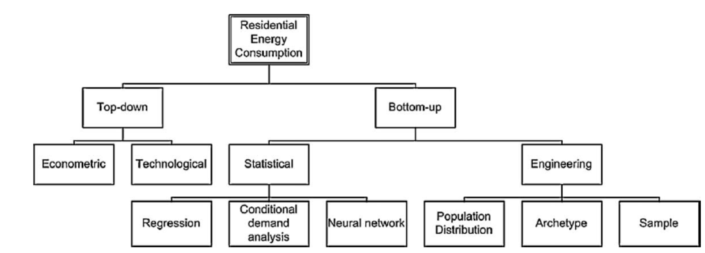
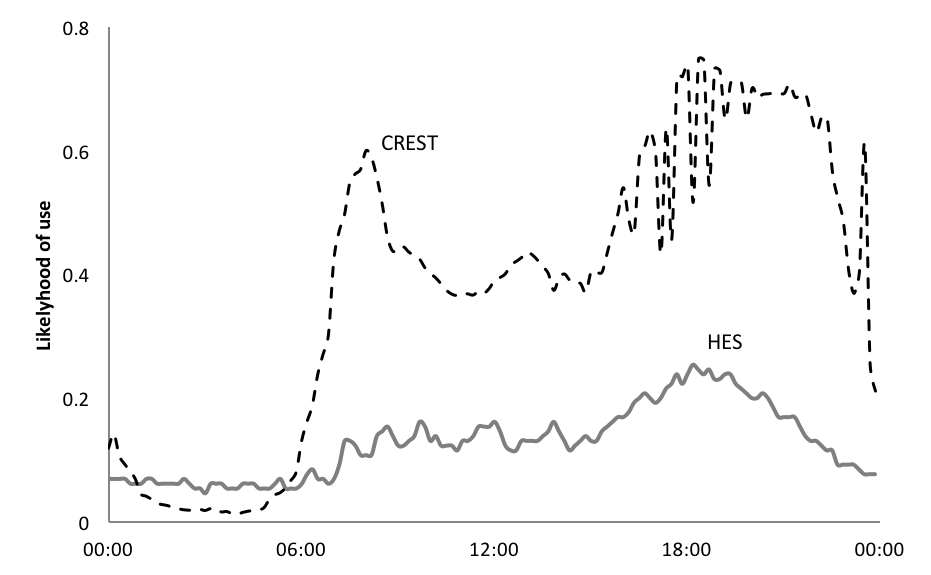

This paper reviews the evolution of residential demand models from simple accounting frameworks into sophisticated temporally resolved stochastic tools. We argue that the primary data supporting these models has not kept pace with the ever increasing demands placed upon them, especially in relation to the timing and flexibility of demand.
We present systematic shortcomings in the representation of activity based electricity consumption and propose new approaches to improve on the ability to model demand baselines and flexibility.

# INTRODUCTION

The role of the demand side is expected to undergo a fundamental change from a passive load that is to be met using the 'predict and provide' paradigm towards an active and responsive part of the system. 
With the closure of 55% of the UK's fossil fuel capacity over the next decade, the system flexibility, which these plant provide, will be greatly reduced. If less flexible low carbon sources are to take their place, new forms of flexibility are needed. The National Infrastructure Commission identified a annual saving potential of up to £8.1bn by 2030 [@NIC16] through a combination of storage, interconnections and demand-side-response (DSR).

The extent to which the 'technical potential' for DSR can be realised in practice is not well understood. Demand side modelling efforts therefore need to extend their focus from assessing demand reduction opportunities, towards a better understanding of the precise timing of demand and its potential flexibility. 

In this paper we argue that current models are not well equipped to address these new requirements and that supporting data is still lacking at the required scale. In Section 2 we perform a brief review of past developments in residential demand models and the data used to support them alongside some of the key literature in this area. The limitations of the latest generation of models to represent the temporally of demand is explored in Section 3, before Section 4 sets out opportunities to overcome these with new data collection approaches. 

# REVIEW OF MODELS AND DATA USED FOR UNDERSTANDING RESIDENTIAL DEMAND
## Taxonomy of residential energy models
Energy models are generally used to explore and explain changes in energy consumption. There are generally two main approaches to modelling energy consumption in the residential sector:  top-down and bottom-up - the terminology referring to the hierarchical level of the data inputs. The use of each depends on the data available and the purpose of the analysis.  Top-down models generally make use of historic sector specific (e.g. residential) time series data of energy consumption and related sector-specific data.  Such top-down models are usually driven by econometric data (such as energy and appliance prices) and technological data (such as autonomous rates of efficiency improvement and ownership rates). On the other hand, bottom-up models require significantly more data at the sub-sector level, and so can account for energy consumption at the regional, individual household or equipment level. Figure 1 shows a simple classification of residential modelling.  [@Swan09,@Kavgic10] 

Bottom up models are usually classified further into two main groups: engineering and statistical. The statistical ones can include regression methods when measured data are available [@Fumo15], conditional demand analysis and neural networks [@Aydinalp02].

However, it is the engineering style of bottom-up model that has, to date, presented the best opportunities to develop a greater understanding of how energy is being used at the sub-sector level, and how user behaviour influences consumption.  A selection of such models is now reviewed.

## Review of selected UK end-use models
We review the historical development of UK residential end-use demand models with the examples of BREHOMES, DECADE, DCM and CREST. This review shows how the demands on these models has changed and increased over time and how analysts have responded by developing new and improved modelling and data collection approaches.

### BREHOMES
BREHOMES is a physically-based residential housing stock model, providing national energy consumption estimates by house type [@Shorrock91]. It requires detailed information on the building type, heating system, internal and external temperatures, etc. Different versions of the underlying BREDEM algorithm support annual consumption (BRDEM-12) or monthly figures (BREDEM-8). This model allows the exploration of technology and policy interventions, especially relating to heating aspects of the home. 

For full housing physically-based stock models, such as this one, the following data is typically required:
models, the following data are required:

- areas of floors, windows, doors, and their U-values.
- heating system information (fuel, type, efficiency), internal
temperatures, external temperatures, heating patterns, solar gains
- occupants
- appliance stock, including cooking fuel type

Sources of such data are discussed in Section XXX3.

### DECADE

The Domestic equipment and carbon dioxide emissions (DECADE) model advanced the resolution of BREHOMES by separating out lighting and appliances.
 DECADE is a detailed end-use model of energy consumption supporting product policy on mandatory energy labels and minimum energy performance standards. [@Fawcett00,@Lane00]

The detailed end-uses include cooking, lighting, water heating, consumer electronics, refrigeration. 
This modelling approach produces annual energy consumption by end-use, with the primary use being the ex-ante impact assessments of technical potential, variation in usage patterns, and policy options [@Boardman94,@Boardman95]. Similar modelling approaches are used internationally [10 XXX I could not find this published].

In addition to appliance stocks used for conventional stock models, this approach draws on replacement rates and use statistics as complementary data.

Product replacement rates are inferred from market research data on sales volume and product turnover. In some cases these data are available for very specific models or product classifications. However, lack of rigorous collection of appliance disposal rates leaves some uncertainty over the number of appliances remaining in service, such as old and inefficient fridges operating as secondary 'beer fridges' in the garage.

Inferring statistics on the actual use patterns of appliances from the available data is one of the most challenging aspects for models of this type. These parts of the simulation carry the largest variance and uncertainty. They are reliant on a patchwork of evidence from industry surveys, diaries and metered surveys.

For lighting, it is possible to deduce use from lamps sold, stock level and the technical lifespan. For incardecants with a short lifetime (1000 hours) and high replacement rate, such estimates give a reasonable estimate. Whereas the deployment of LED is larger numbers make such estimates more difficult. The timing of lighting use still has to be assumed. Some lighting may remain on all day or throughout the night, regardless of active occupancy. More recently appliance level metering  have increased confidence in these figures (see HES below).

Cooking appliances, such as ovens or hobs, are derived from regression analysis of cooking data of sample homes. [@Palmer97]

DECADE included first attempts to estimate load curves by end-use, but data supporting data was insufficient at the time and still remains an inhibiting factor in international attempts to adopt this approach [@Michaelis14]. Societal distribution of consumption is not represented.

### UKDCM 
The DECADE Modelling was extended to create the UK Domestic Carbon Model (UKDCM) model [@Boardman05], which extends the differentiation of loads to include space/water heating along with building types, using BREDEM-8 algorithm. Compared to BREHOMES new data on appliances [XXX can we be specific about the data? do we mention it in the 'Data' section? XXX] and lighting could be included, enabling long term technical and policy scenarios to be examined in more detail [13 XXX published?].

### CREST 
The Centre for Renewable Energy Systems Technology (CREST) model simulates household load profiles with one minute resolution (@Richardson10b). The model has found a wide range of applications, including network constraints analysis. 

Load profiles are generated based on the Markov chain modelling technique, whereby each state is the result of a set of probability distributions resulting from the previous state. A household has a given number of occupants, who have a probability distribution of being 'active occupants', i.e. likely to use certain appliances. The occupancy, and to some extent the activity probabilities, are informed by the UK Time Use survey of 2000 (@Lader06).

The appliance ownership itself is based on probability distributions of 33 common household appliances from the UK Market Transformation Programme [@Defra06]

The stochastic method results in each model run to produce a unique and 'realistic' load profile.

## Data sources for bottom-up household models
This section summarises some of the key data sources used in bottom-up energy-use models.

### Sales figures and market research
Governments and private organisations collect statistics and information on product sales and their technical characteristics. Australia, U.S.A. and China keep formal registration databases of technologies deployed, which provide robust data for appliance stock models. 
Various countries require energy-using products to be registered centrally before they can be placed in the market to comply with minimum energy performance or labelling requirements. The EU has not yet adopted such a database.

Technical information on products can also be obtained directly from manufactures. Specifications are increasingly available online and can be collected via web 'scrapers'. Key parameters include U-values, power ratings, and efficiency values. [XXX ref]

Given the short life of incandescent light bulbs, it is possible for models like DECADE to infer their use based on the replacement rate. For LEDs the link between sales and total energy consumed has become more difficult. [XXX Kevin - is that fair to say?]

### Physical inspection of homes
Physical inspections can provide insights into the ownership and distribution of end-use equipment along with physical characteristics of the buildings themselves, such as used for SAP assessments.

Such surveys can be through home visits, such as those used to generate SAP assessments or provide representative national statistics on the housing stock. Governments also collect and collate these through the use of national surveys. Cost and intrusiveness of this approach is high.

### Home surveys
Governments and market research companies collect information on appliance ownership, recent sales and efficiency measures via questionnaires. Representative panels with multiple thousand surveys are available from GfK and the English Housing Survey (EHS).

[XXX Cite GfK data] [XXX Cite Department for Communities and Local Government (DCLG)]
Surveys are sometimes complemented by physical inspection for a sub-sample of the properties. 

Socio-demographic information is included or can be brought in from other surveys and national statistics (based on census). These allow to calibrate models to represent national distributions or subsets thereof.

### Interview survey of householders
@Janda11 and @Huebner15 and @Fell12] argue that energy consumption of homes is poorly represented by their physical characteristics alone. 65% of the variation in energy use is not attributable to appliances or building properties.

Interviews of the householders themselves can provide not only insights into ownership of equipment (without the need for a physical inspection), but also help to understand usage patterns and motivation for use.

Relevant UK examples include the annual Survey of English Housing (N=15,000), published annually as Housing in England reports 1993-93 [XXX should this read 83?] to 2007-08 inclusive [@DCLG16a]. Prior to 2008, The ONS interviewed householders for the English Household Conditions Survey (EHCS) [@DCLG16].

### Diaries and time-use surveys
Greater detail of household activities can be obtained with time-use diaries and targeted diaries focussing on equipment usage, such as routines and frequency of washing machine use. [XXX cite data?]

Time use diaries present a special case of survey and provide a rich insight into what people are actually doing (activity). 
These collect self reported activity diaries from thousands of participants revealing timing and durations. [@Gershuny03]

These data are collected longitudinally around every decade in many European countries using harmonised time use codes. These allow comparisons between regions and trends over time \footnote{Some caution should be exercised when making such comparisons. Inconsistencies in the meaning of activities across time and cultures, and changes in methodology may limit their comparability. See @Anderson16 }

Understanding _why_ consumers are acting in particular ways is attempted to be illuminated with semi-structured interviews and focus groups, typically with significantly smaller sample sizes. [XXX cite data]

### Metering of homes and end-uses
None of the above methods explicitly capture how much and when appliances are in use. Smart meters and appliance level monitors are becoming ubiquitous, such that recent studies began to collect household and appliance consumption with increasingly high temporal resolution.
Notable examples include: [XXX Kevin: are these appliance or household level studies?]

- BRANZ Household Energy End-Use Project (HEEP) metered 400 homes in New Zealand (1997 - 2007) [@Isaac09]
- STEM metered 300-400 homes in Sweden (2007-08) [@Zimmermann09]
- REMODECE covered over 100 homes in 12 European countries. [@Almeida11]
- HES captured appliances in 250 homes in the UK [@HES13]

Smart meter data does not by itself reveal either the appliances in use, nor the activities this consumption supported. With sufficiently high temporal resolution, some appliances can be disaggregated from other loads. @Wilson15 developed approaches to infer activities from smart meter data.

Data from electricity meters can be used, to track how consumers respond to different signals.  For example, the CER, electricity smart metering customer behaviour trials. [insert information here. Check if should be moved to next section. . More experiment, over 5,000 recruits.]
Similarly, CLNR- British Gas trials, consisting over 13,000 electricity customers, is generating useful information that can be used in end-use models. However, it worth nothing that it is slightly biased towards customers with low carbon technologies, and is also examined load (and generation) profiles from meter data. [insert more, and check if we should move]

#### Elexon

In the UK Elexon collect electricity use data on a rolling bases and update profiles twice a year. These profiles are used for settlement purposes [@Elexon13b]. The target sample size is 2,500 randomly selected households. Profiles are generated for 8 distinct classes, the first two of which are domestic households with or without low cost night time tariffs (Economy 7).

#### CBT
The Electricity Smart Metering Customer Behaviour Trials (CBT) involved over 5000 participants, metered on a half hourly bases and exposed to a range of static time of use tariffs (@CER11).

The data provides statistically robust comparisons between a control group and customers exposed to higher peak time prices. Overall usage was reported to be reduced by 2.5% and peaks by as much as 8.8%. What this study is not able to answer is how these changes came about and whether the peak reduction was a form of 'load shifting' or the avoidance of loads.

#### CLNR
The Customer-Led Network Revolution (CLNR) trials involved about 11,000 domestic customers and 2,000 Small and Medium Enterprises. 
650 of the residential customers were subject to Time of Use tariffs. Data and insights from the project have been published [@CLNR13, @CLNR13a, @CLNR14, @CLNR15, @CLNR15a].

#### HES
The UK's Household Electricity Survey (HES) aimed to provide a more detailed insight into the appliance ownership and use patterns. 250 owner-occupier households were monitored down to the individual appliance level. 26 households were monitored for a full year, the remaining over one month.
Some participants were also required to keep detailed logs of how they used certain appliances. (@HES13, @Zimmermann12)

These new sources of data allow to test modelling assumptions and can themselves enable enhanced modelling approaches. The next section will build on their ability to give insights into the timing of electricity use at household level.

# Representing temporality in household demand models

In this section we will explore how well occupancy and activity data support the simulation of realistic household profiles. Empirical data from Elexon [@Elexon13b] and HES [@HES13] is used to contrast intra-day profiles for households and selected appliances.

## Active occupancy based consumption

Figure XXX2 shows the profiles for each of the three sources of data averaged across their sample (HES N=243, CREST 243 runs, Elexon N=2500 class 1)

 The overall shape of HES and Elexon data is very similar, with HES displaying a slightly higher average load, but almost identical peak demand. The higher use has been explained by the sample exclusively containing owner-occupiers [@Zimmermann12]. CREST data is calibrated to produce average national consumption figures. The distribution throughout the day is markedly different to the empirical data. Night time consumption is underestimated, while morning and evening peaks are significantly higher by up to 45% and 32% respectively.

This suggests that the link between active occupancy and consumption may not be as strong as assumed in the model. Night time baseload, which occurs when occupants are classified as 'non active', continues significant loads. A possible explanation is the prevalence of stand-by appliances, which do not require active user interaction. Evidence for smart appliances operating deliberately at night has not been found in the available data.

The overestimate of 'peak periods' is to some extent a compensation effect, due to the calibration forcing the output to produce national average figures over a full day. However, Figure XXX2 shows that mid-day periods are less affected. This, too, is partially explained with lower active occupancy in mid-day.

## Activity based consumption

HES data allows this analysis to go one step further. The appliance level data give some additional insights into 'what people did' with the electricity at different times of day. We will focus here on 'cooking', which in the CREST model is treated as an activity with a probability distribution informed by 'food preparation' activities in the time use survey from 2000.

Figure XXX3 contrasts the likelihood of a cooker being used at a given time of day. The CREST data follows a similar profile to the overall use, with morning and evening peaks. The empirical HES data, however, has a far less pronounced morning peak for cookers.

The reason for this discrepancy is the assumed link between 'food preparation' and use of a 'cooker'. While many survey participants reported food preparation in the morning hours, the use of a cooker is less likely to play a role in breakfast preparation than, for instance, at dinner time.

As this example illustrates, neither the occupancy nor the activity information can be satisfactorily be used to create bottom-up demand profiles. In the next section we therefore explore new ways to strengthen the predictive power of such models.

# Modelling flexibility

Section 1 laid out the evolution of data and models in response to emerging technical and policy challenges, and suggests that data availability shapes and constrains what such models can set out to achieve.

The motivation for initial models was a desire to understand  overall demand measured in annual collective consumption, with a view to reduce it. Later operational challenges requiring temporally and spatially resolved data.

With flexibility itself is becoming a unit of enquiry residential demand models have to adapt.
In supply side models a flexible generator can be defined with the following parameters:

- Ramp rate (MW/hour)
- Capacity constraints (min and max MW)
- State of operation (MW)
- Reliability (%)
- Marginal cost of operation (£/MWh/h)

Some of these parameters may be interdependent. The ramp rate relies on the plant not being cold and generating within its range of stable operation.

Storage can be represented with the addition of storage capacity, state of charge (MWh) and round trip efficiency.

Since storage and generators can be represented as revenue optimising units, their operation can be approximated using mathematical optimisation for given market prices.

One approach to represent demand side flexibility is to divide appliances into 'flexible' and 'inflexible' loads. Flexible appliances are moved to low cost periods and the resulting load profile can be reintroduced to the existing supply model. This approach can reveal the saving potential from such load shifts (@Strbac16,@NIC16). It does, however, not reveal the 'cost' of its provision, nor the societal constraints that may inhibit the theoretical technical potential assumed.

A second approach is to assume price elastic demand. @Roscoe10 use elasticity as the principle response mechanism. As the price for electricity goes up, certain appliances are assumed to reduce in load. Data for this approach is available from time of use trials (@CER11,@CLNR15). 

Price elasticity as a metric is consistent with the 'cost optimisation' principle of supply side models. It may, however, not be the sole rationale for demand side flexibility. @Grunewald16 argues that much of the flexibility on the demand side is routed in practices of everyday life. How far the load of a dishwasher can be shifted in time is not just a function of price. Constraints in time and space, skills and availability of clean clothes (e.g. material) factor heavily in the provision of flexibility [@Higginson14].

## Measuring flexibility

If the locus of flexibility resides at least partially with people and their practices, then measuring load profiles or appliance use alone may be insufficient as shown in Section 3.2.

Unlike with power stations, where flexibility can be measured as a change to its current output, demand side loads are naturally fluctuating. This makes the reference baseline a major challenge in assessing its flexibility.
Flexibility is a relative concept: one can only be flexible in relation to a 'business as usual' case. For the demand side this means that flexibility cannot be measured or even inferred from a single measurement.

First, a sufficiently large and representative sample is needed to provide a reference baseline or control group. Against this baseline flexibility can be measured as a dynamic response. The observed difference can be in response to any change conditions between a control group and the sample group, including, but not limited to price signals.

The variability in end uses over time and across populations is high, whereas the typical responses observed in trials is typically small (see Section 2). To reliably tell true responses from stochastic variation, large sample sizes may be required. Estimates for appropriate sample sizes tend to be greater than 2000, which is significantly larger than most studies in this area to date.

Smart meter data is expected to become available at such scales and methods to infer activity information from these data are being developed, such as those by @Wilson15. Here we propose an alternative approach which captures activities explicitly.

## Collecting new data on flexibility

Insights into human activities with large sample sizes is already available in the form of time use studies (see 2.3.5). 
Time use data already informs the occupancy and activity patterns, observed in Section 3, and has been used to understand the possible composition of loads (@Torriti15).

What time use data presently does not allow to infer is energy consumption or flexibility. Here we will discuss how to incorporate these two new dimensions.

### Conditions for new data to support insights into flexibility

We argue for four conditions which new data on demand side flexibility should adhere to, if policy relevance is to be achieved: 

1. Provision of a reference baseline, 
2. scalability, 
3. working hypothesis, and 
4. dynamic collection methods.

#### Scalability
Electricity use is highly diverse and variable. Data that is intended to support robust analysis of causal relationships (such as demand response) needs to be sufficiently large to tell 'signal' from 'noise'. To detect a 5% signal with 95% confidence, sample sizes typically need to exceed 2000. With conventional 'case study' approaches and personal visits to participating households, these sample sizes are prohibitively expensive for many research budgets. Scalability therefore requires a low cost approach that can be replicated many times.

#### Reference baseline
One of the challenges with flexibility and demand response is to prove that is actually happened. Is low demand the result of a purposeful response, or might it have happened anyway? A baseline constitutes a reference case against which responses can be judged within statistical means. 

#### Dynamic collection methods
Flexibility is a dynamic property. Whether an object, activity or energy-use is flexible or not is only exposed in response to an intervention (and against the above mentioned baseline).
It cannot be observed within a static snapshot. Even an interview approach attempting to collect a participants perceived flexibility is unlikely to yield reliable results. A claim that one 'would' be flexible about the timing of certain activities is very different from actioning them, not least because this action would have knock-on effects on many other activities, which are difficult for interviewees to fully conceptualise.

#### Working Hypothesis
The leap from observing correlations between interventions and responses to claiming a causal relationship can easily lead to artificial results, especially when many variables are tested at the same time. Wherever large datasets with a large number of variables are used for analysis it is therefore advisable to set out a clear working hypotheses first, to ensure that findings are genuine. As a simple example, if energy data can be broken down into hundreds of sub-groups, it is very likely that one of these sub-groups has greatly reduced load during an intervention. If this happens to be male, over 65s, with a low income, 2 children and a name beginning with 'F', does not necessarily mean that this group is more responsive or flexible. If however, one set out with this hypothesis and it is borne out by the data, such finding should be taken more seriously.

### Suggested approaches to collect such data
Time-use data fulfils the first condition for scalability. By combining this collection method with a low cost monitoring approach for electricity, it is possible to create a baseline of activity related electricity use. Such data collection has been developed by the METER project, which deploys low cost smart phones to collect these data [@Grunewald15a].

All members of a household above the age of eight are encouraged to complete a time-use diary over 28 hours (spanning two 5-9pm periods), while their combined load profile is sampled with 1 second resolution. Household and individual surveys are collected, such that data can be grouped and clustered.

In a second phase the passive observation of activities and electricity loads will turn into active response observation, where participants will receive specific interventions and any changes in both activities and load shape can be observed and contrasted against a control group without intervention. The scale allows for groups of sufficient size to be compared and even small responses to be exposed.

# Conclusions and discussion [all]

Residential demand models have undergone considerable improvements over time in their ability to represent household demand at a more accurate and granular level. Initial attempts to simulate the temporality of demand are still held back by appropriate data.

We have shown systematic errors in the prediction of peak demand contributions of up to 45%.

Instead of working with conveniently available data, this paper suggests that purposeful and targeted collection of data may help future energy demand models to better reflect increasing complexities of 'responsive' demand. To address the data shortage and to prepare for future modelling needs on demand side flexibility we proposed 4 criteria, which such data needs to meet: 1) scalability, 2) reference baseline, 3) dynamic collection and 4) a working hypothesis.

Such a methodology has been presented based on the large scale co-collection of time-use and high resolution household demand data.

# References

