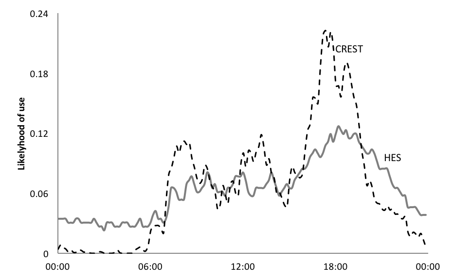

# INTRODUCTION
With the closure of 55% of the UK's fossil fuel capacity over the next decade, the system flexibility, which these plant provide, will be greatly reduced. If less flexible low carbon sources are to take their place, new forms of flexibility are needed.
Interconnections, storage and demand response hold great promise in this area.
 For the UK the potential annual system savings from demand response have been estimated to be in the billions of pounds [1]. The extent to which the 'technical potential' can be realised is not well understood.

In this paper we argue that current models are not well equipped to address this new requirement and that supporting data is still lacking at the required scale.

We explore the status of demand models and identify conceptual shortcomings and data gaps that need to be addressed if we are to better understand demand side flexibility.

##	Changing needs for evidence in the residential sector
¬	From overall demand to flexibility
¬	Any definitions, scope of paper
¬	Literature review (though some of this will sit more neatly in following sections)

# REVIEW OF MODELS AND DATA USED FOR UNDERSTANDING RESIDENTIAL DEMAND
## Taxonomy of residential energy models
Energy models are generally used to explore and explain changes in energy consumption. There are generally two main approaches to modelling energy consumption in the residential sector:  top-down and bottom-up - the terminology referring to the hierarchical level of the data inputs. The use of each depends on the data available and the purpose of the analysis.  Top-down models generally make use of historic sector specific (e.g. residential) time series data of energy consumption and related sector-specific data.  Such top-down models are usually driven by econometric data (such as energy and appliance prices) and technological data (such as autonomous rates of efficiency improvement and ownership rates). On the other hand, bottom-up models require significantly more data at the sub-sector level, and so can account for energy consumption at the regional, individual household or equipment level. Figure 1 shows a simple classification of residential modelling.  [1] [2]

Bottom up models are usually classified further into two main groups: engineering and statistical. The statistical ones can include regression methods when measured data are available [3], conditional demand analysis and neural networks [4].

However, it is the engineering style of bottom-up model that has, to date, presented the best opportunities to develop a greater understanding of how energy is being used at the sub-sector level, and how user behaviour influences consumption.  A selection of such models is now reviewed.

## Review of selected UK end-use models
We review the historical development of UK residential end-use demand models with the examples of BREHOMES, DECADE, DCM and CREST. This review shows how the demands on these models has changed and increased over time and how analysts have responded by developing new and improved modelling and data collection approaches.

### BREHOMES
BREHOMES is a physically-based residential housing stock model, providing national energy consumption estimates by house type [5]. It requires detailed information on the building type, heating system, internal and external temperatures, etc. Different versions of the underlying BREDEM algorithm support annual consumption (BRDEM-12) or monthly figures (BREDEM-8). This model allows the exploration of technology and policy interventions, especially relating to heating aspects of the home. 

For full housing physically-based stock models, such as this one, the following data is typically required:
models, the following data are required:

- areas of floors, windows, doors, and their U-values.
- heating system information (fuel, type, efficiency), internal
temperatures, external temperatures, heating patterns, solar gains
- occupants
- appliance stock, including cooking fuel type

Sources of such data are discussed in Section XXX3.

### DECADE

The Domestic equipment and carbon dioxide emissions (DECADE) model advanced the resolution of BREHOMES by separating out lighting and appliances.
 DECADE is a detailed end-use model of energy consumption supporting product policy on mandatory energy labels and minimum energy performance standards. [6,7]
The detailed end-uses include cooking, lighting, water heating, consumer electronics, refrigeration. 
This modelling approach produces annual energy consumption by end-use, with the primary use being the ex-ante impact assessments of technical potential, variation in usage patterns, and policy options [8, 9]. Similar modelling approaches are used internationally [10].

In addition to appliance stocks used for conventional stock models, this approach draws on replacement rates and use statistics as complementary data.

Product replacement rates are inferred from market research data on sales volume and product turnover. In some cases these data are available for very specific models or product classifications. However, lack of rigorous collection of appliance disposal rates leaves some uncertainty over the number of appliances remaining in service, such as old and inefficient fridges operating as secondary 'beer fridges' in the garage.

Inferring statistics on the actual use patterns of appliances from the available data is one of the most challenging aspects for models of this type. These parts of the simulation carry the largest variance and uncertainty. They are reliant on a patchwork of evidence from industry surveys, diaries and metered surveys.

For lighting, it is possible to deduce use from lamps sold, stock level and the technical lifespan. For incardecants with a short lifetime (1000 hours) and high replacement rate, such estimates give a reasonable estimate. Whereas the deployment of LED is larger numbers make such estimates more difficult. The timing of lighting use still has to be assumed. Some lighting may remain on all day or throughout the night, regardless of active occupancy. More recently appliance level metering  have increased confidence in these figures (see HES below).

Cooking appliances, such as ovens or hobs, are derived from regression analysis of cooking data of sample homes. [XXX cite Billsavers project, LEEP 1996]

DECADE included first attempts to estimate load curves by end-use, but data supporting data was insufficient at the time and still remains an inhibiting factor in international attempts to adopt this approach [11]. Societal distribution of consumption is not represented.

### UKDCM 
The DECADE Modelling was extended to create the UK Domestic Carbon Model (UKDCM) model [12], which extends the differentiation of loads to include space/water heating along with building types, using BREDEM-8 algorithm. Compared to BREHOMES new data on appliances [XXX can we be specific about the data? do we mention it in the 'Data' section? XXX] and lighting could be included, enabling long term technical and policy scenarios to be examined in more detail [13].

### CREST 
The Centre for Renewable Energy Systems Technology (CREST) model simulates household load profiles with one minute resolution (@Richardson10b). The model has found a wide range of applications, including network constraints analysis. 

Load profiles are generated based on the Markov chain modelling technique, whereby each state is the result of a set of probability distributions resulting from the previous state. A household has a given number of occupants, who have a probability distribution of being 'active occupants', i.e. likely to use certain appliances. The occupancy, and to some extent the activity probabilities, are informed by the UK Time Use survey of 2000 (@Lader06).

The appliance ownership itself is based on probability distributions of 33 common household appliances from the UK Market Transformation Programme [@Defra06]

The stochastic method results in each model run to produce a unique and 'realistic' load profile.

## Data sources for bottom-up household models
This section summarises some of the key data sources used in bottom-up energy-use models.

### Sales figures and market research
Governments and private organisations collect statistics and information on product sales and their technical characteristics. Australia, U.S.A. and China keep formal registration databases of technologies deployed, which provide robust data for appliance stock models. 
Various countries require energy-using products to be registered centrally before they can be placed in the market to comply with minimum energy performance or labelling requirements. The EU has not yet adopted such a database.

Technical information on products can also be obtained directly from manufactures. Specifications are increasingly available online and can be collected via web 'scrapers'. Key parameters include U-values, power ratings, and efficiency values. [XXX ref]

Given the short life of incandescent light bulbs, it is possible for models like DECADE to infer their use based on the replacement rate. For LEDs the link between sales and total energy consumed has become more difficult. [XXX Kevin - is that fair to say?]

### Physical inspection of homes
Physical inspections can provide insights into the ownership and distribution of end-use equipment along with physical characteristics of the buildings themselves, such as used for SAP assessments.

Such surveys can be through home visits, such as those used to generate SAP assessments or provide representative national statistics on the housing stock. Governments also collect and collate these through the use of national surveys. Cost and intrusiveness of this approach is high.

### Home surveys
Governments and market research companies collect information on appliance ownership, recent sales and efficiency measures via questionnaires. Representative panels with multiple thousand surveys are available from GfK and the English Housing Survey (EHS).

[XXX Cite GfK data] [XXX Cite Department for Communities and Local Government (DCLG)]
Surveys are sometimes complemented by physical inspection for a sub-sample of the properties. 

Socio-demographic information is included or can be brought in from other surveys and national statistics (based on census). These allow to calibrate models to represent national distributions or subsets thereof.

### Interview survey of householders
@Janda11 and @Huebner15 and [19] argue that energy consumption of homes is poorly represented by their physical characteristics alone. 65% of the variation in energy use is not attributable to appliances or building properties.

Interviews of the householders themselves can provide not only insights into ownership of equipment (without the need for a physical inspection), but also help to understand usage patterns and motivation for use.

Relevant UK examples include the annual Survey of English Housing (N=15,000), published annually as Housing in England reports 1993-93 [XXX should this read 83?] to 2007-08 inclusive [14]. Prior to 2008, The ONS interviewed householders for the English Household Conditions Survey (EHCS) [15].

### Diaries and time-use surveys
Greater detail of household activities can be obtained with time-use diaries and targeted diaries focussing on equipment usage, such as routines and frequency of washing machine use. [XXX cite data?]

Within householder surveys, time use diaries can be included. These provide a rich insight into what people are actually doing (activity). [XXX TUS bit here]

Understanding _why_ consumers are acting in particular ways is attempted to be illuminated with semi-structured interviews and focus groups, typically with significantly smaller sample sizes. [XXX cite data]

### Product registration and sales
[moved up]

### Metering of homes and end-uses
None of the above methods explicitly capture how much and when appliances are in use. Smart meters and appliance level monitors are becoming ubiquitous, such that recent studies began to collect household and appliance consumption with increasingly high temporal resolution.
Notable examples include: [XXX Kevin: are these appliance or household level studies?]

- BRANZ Household Energy End-Use Project (HEEP) metered 400 homes in New Zealand (1997 - 2007) [16]
- STEM metered 300-400 homes in Sweden (2007-08) [17]
- REMODECE covered over 100 homes in 12 European countries. [18]
- HES captured appliances in 250 homes in the UK [@HES13]

Smart meter data does not by itself reveal either the appliances in use, nor the activities this consumption supported. With sufficiently high temporal resolution, some appliances can be disaggregated from other loads. @Wilson15 developed approaches to infer activities from smart meter data.

Data from electricity meters can be used, to track how consumers respond to different signals.  For example, the CER, electricity smart metering customer behaviour trials. [insert information here. Check if should be moved to next section. . More experiment, over 5,000 recruits.]
Similarly, CLNR- British Gas trials, consisting over 13,000 electricity customers, is generating useful information that can be used in end-use models. However, it worth nothing that it is slightly biased towards customers with low carbon technologies, and is also examined load (and generation) profiles from meter data. [insert more, and check if we should move]

#### Elexon

In the UK Elexon collect electricity use data on a rolling bases an update profiles twice a year to be used for settlement [@Elexon13b]. The target sample size is 2,500 randomly selected households. Profiles are generated for 8 distinct classes, the first two of which are domestic households with or without low cost night time tariffs (Economy 7).

#### CBT
The Electricity Smart Metering Customer Behaviour Trials (CBT) involved over 5000 participants, metered on a half hourly bases and exposed to a range of static time of use tariffs (@CER11).

The data provides statistically robust comparisons between a control group and customers exposed to higher peak time prices. Overall usage was reported to be reduced by 2.5% and peaks by as much as 8.8%. What this study is not able to answer is how these changes came about and whether the peak reduction was a form of 'load shifting' or the avoidance of loads.

#### CLNR
The Customer-Led Network Revolution (CLNR) trials involved about 11,000 domestic customers and 2,000 Small and Medium Enterprises. 
650 of the residential customers were subject to Time of Use tariffs. Data and insights from the project have been published [@CLNR13, @CLNR13a, @CLNR14, @CLNR15].

#### HES
The UK's Household Electricity Survey (HES) aimed to provide a more detailed insight into the appliance ownership and use patterns. 250 owner-occupier households were monitored down to the individual appliance level. 26 households were monitored for a full year, the remaining over one month.
Some participants were also required to keep detailed logs of how they used certain appliances. (@HES13, @Zimmermann12)

These new sources of data allow to test modelling assumptions and can themselves enable enhanced modelling approaches. The next section will build on their ability to give insights into the timing of electricity use at household level.

# Representing temporality in household demand models

In this section we will explore how well occupancy and activity data support the simulation of realistic household profiles. Empirical data from Elexon [@XXX] and HES is used to contrast intra-day profiles for households and selected appliances.

## Active occupancy based consumption

Figure XXX2 shows the profiles for each of the three sources of data averaged across their sample (HES N=243, CREST 243 runs, Elexon N=2500 class 1)

 The overall shape of HES and Elexon data is very similar, with HES displaying a slightly higher average load, but almost identical peak demand. The higher use has been explained by the sample exclusively containing owner-occupiers [@Zimmermann12]. CREST data is calibrated to produce average national consumption figures. The distribution throughout the day is markedly different to the empirical data. Night time consumption is underestimated, while morning and evening peaks are significantly higher by up to 45% and 32% respectively.

This suggests that the link between active occupancy and consumption may not be as strong as assumed in the model. Night time baseload, which occurs when occupants are classified as 'non active', continues significant loads. A possible explanation is the prevalence of stand-by appliances, which do not require active user interaction. Evidence for smart appliances operating deliberately at night has not been found in the available data.

The overestimate of 'peak periods' is to some extent a compensation effect, due to the calibration forcing the output to produce national average figures over a full day. However, Figure XXX2 shows that mid-day periods are less affected. This, too, is partially explained with lower active occupancy in mid-day.

## Activity based consumption

HES data allows this analysis to go one step further. The appliance level data give some additional insights into 'what people did' with the electricity at different times of day. We will focus here on 'cooking', which in the CREST model is treated as an activity with a probability distribution informed by 'food preparation' activities in the time use survey from 2000.

Figure XXX3 contrasts the likelihood of a cooker being used at a given time of day. The CREST data follows a similar profile to the overall use, with morning and evening peaks. The empirical HES data, however, has a far less pronounced morning peak for cookers.

The reason for this discrepancy is the assumed link between 'food preparation' and use of a 'cooker'. While many survey participants reported food preparation in the morning hours, the use of a cooker is less likely to play a role in breakfast preparation than, for instance, at dinner time.

As this example illustrates, neither the occupancy nor the activity information can be satisfactorily be used to create bottom-up demand profiles. In the next section we therefore explore new ways to strengthen the predictive power of such models.

# Outlook for new models with new data

- the previous section has shown that temporalities of electricity use in households are poorly captured in current models, due to a lack of data. 
- the Section on HES {have we got that covered?} described the challenges in scaling up instrumentation based approaches. Both cost and intrusiveness inhibit large scale application.
- Smart Meter data is expected to become readily available over coming years. However, the experience with early trials in the UK has highlighted challenges of data access and privacy (ref EDRP)
- Here we discuss not just what data could become easily accessible, but in the context of the previous sections, what evidence this data is intended to support and what limitations remain due to data collection challenges. We will argue that purposeful collection of the 'right' data will allow future models to provide more meaningful answers to emerging questions in energy research.

## New Data - what for?
Section 1 laid out the evolution of data and models in response to emerging technical and policy challenges, and suggests that data availability shapes and constrains what such models can set out to achieve.

The motivation for initial models was a desire to understand  overall demand measured in annual collective consumption, with a view to reduce it. Later operational challenges requiring temporally and spatially resolved data.

With the emergence of variable renewable sources as cost competitive generators, new challenges need to be addressed to support their effective system integration. Alongside flexible generators, extended and smarter networks and storage, demand side flexibility is expected to play a potentially large role for future system balancing.

Flexibility itself is therefore becoming a unit of enquiry. This is a fundamental change in the location of flexibility, which hitherto is conveniently delivered from fossil fuel stocks. It also constitutes a significant change in how flexibility can be represented in models. A flexible generator can be defined with a small number of parameters

- Ramp rate (MW/hour)
- Capacity constraints (min and max MW)
- State of operation (MW)
- Reliability (%)
- Marginal cost of operation (£/MWh/h)

Some of these parameters are interdependent. For example, a part loaded plant (somewhere between it's minimum stable operation and its maximum capacity) can ramp significantly faster than one starting from a 'cold' state, where the power station needs to be gradually brought up to temperature - a process that can take hours or even days. A plant operating at its minimum stable operation, which often is well above 30% of its maximum capacity, can only provide 'upward' flexibility, and vice versa for a plant running at capacity.

Storage can be represented with similar parameters, principally adding the State of Charge (MWh) as an additional constraint (full stores cannot charge, empty ones cannot discharge).

Since storage and generators can be represented as revenue optimising, their operation can be approximated using mathematical optimisation for given market prices, resulting from a static demand profile.

A deterministic approach to demand side flexibility is to decompose the load into appliances and to divide these up into 'flexible' and 'inflexible'. Load of flexible appliances is moved to low cost periods and the resulting load profile can be reintroduced to the existing supply model. This approach can reveal the saving potential from such load shifts (@Strbac16,@SmartPower). It does, however, not reveal the 'cost' of its provision, nor the societal constraints that may inhibit the technical potential.

The logical translation of the cost optimisation approach is to assign similar parameters to the demand side as have been used for supply. Roscoe et al. use price elasticity as the principle response mechanism. As the price for electricity goes up, certain appliances are said to reduce in load. Data for this approach is available from trials using differing prices (@CER,@CLNR). Elasticity can be measured as the ratio between a change in demand to change in price, and applied in the model to create a load profile that responds to prices.

The latter approach begins to reveal the 'cost' of flexibility and, if collected alongside socio-demographic data, also allows to infer which groups or clusters may be more amenable to flexibility than others.

Price elasticity as a metric is consistent with the 'cost optimisation' principle of supply side models. It may not necessarily be the sole rationale for demand side flexibility. @Grunewald_Demand16 argues that much of the flexibility on the demand side is routed in practices of everyday life. How far the load of a dishwasher can be shifted in time is not just a function of price. Constraints in time and space, skills and availability of clean clothes (e.g. material) all factor heavily in the provision of flexibility.

Here we propose an incremental improvement on existing data, which could provide better visibility of these underlying factors and thus lead to more accurate forward projections of demand side flexibility.

## Measuring flexibility

If the locus of flexibility resides at least partially with people and their practices, then measuring appliance use alone may not provide a good insight into flexibility. Difficult as it may appear at first, capturing activities of electricity users alongside their actual power consumption would illuminate the origins and constraints of flexibility better.

Since flexibility is a relative concept -- one can only be flexible in relation to a 'business as usual' case -- it cannot be measured in a single pass. For a power station it is reasonable enough to assume a steady state as a baseline against which to measure a flexible response. For constantly changing, volatile and diverse load profiles of end users (@DEMAND-peak16), the reference baseline is harder to define. Some users may routinely use little electricity at certain times. Crediting them with flexibility would be misleading.

A sufficiently large and representative sample is therefore important to form a reference baseline, before claims about flexibility can be made.

From this baseline flexibility can be measured as a dynamic response. The response can be any difference in conditions between a control group and the sample group, including, but not limited to price signals.

The variability in end uses over time and across populations is high, whereas the typical responses observed in trials are relatively small (5-10% of load at peak times). To reliably tell true responses from stochastic variation, large sample sizes may be required. Estimates for appropriate sample sizes tend to be greater than 2000, which is significantly larger than most studies in this area to date.

Smart meter data is expected to become available at these scales. @Wilson propose methods to infer activity information from these data. Here we propose an alternative approach which captures activities explicitly and may inform inferences of activities in future.

<!-- 
- what is flexible (people rather than appliances)
- needs a baseline (flexible in relation to what)
- needs dynamic monitoring (baseline vs flexible case)
- high variability and diverse set of enablers and inhibitors for flexibility (needs a large sample)
 -->

## Collecting new data on flexibility

Insights into human activities with large sample sizes is already available in the form of time use studies. These collect self reported activity diaries from thousands of participants. Time use data provides rich insights into the allocation of time to different activities (time spent asleep, at work, with friends...) and its distribution within a population (male / female, rich / poor, young / old). These data are collected longitudinally around every decade in many European countries using harmonised time use codes. These allow comparisons between regions and trends over time \footnote{Some caution should be exercised when making such comparisons. Inconsistencies in the meaning of activities across time and cultures, and changes in methodology may limit their comparability. See @Anderson16 }

Time use data already informs occupancy patterns for household models (see Section 3 on CREST), and has been used to understand the possible composition of loads (@Torriti15).

What time use data presently does not allow to infer is energy consumption or flexibility. Here we will discuss how to incorporate these two new dimensions.

### Conditions for new data to support insights into flexiblity

We argue for four conditions which new data on demand side flexibility should adhere to, if policy relevance is to be achieved: 

1. Provision of a reference baseline, 
2. scalability, 
3. working hypothesis, and 
4. dynamic collection methods.

#### Scalability
Electricity use is highly diverse and variable. Data that is intended to support robust analysis of causal relationships (such as demand response) needs to be sufficiently large to tell 'signal' from 'noise'. To detect a 5% signal with 95% confidence, sample sizes typically need to exceed 2000. With conventional 'case study' approaches and personal visits to participating households, these sample sizes are prohibitively expensive for many research budgets. Scalability therefore requires a low cost approach that can be replicated many times.

#### Reference baseline
One of the challenges with flexibility and demand response is to prove that is actually happened. Is low demand the result of a purposeful response, or might it have happened anyway? A baseline constitutes a reference case against which responses can be judged within statistical means. 

#### Dynamic collection methods
Flexibility is a dynamic property. Whether an object, activity or energy-use is flexible or not is only exposed in response to an intervention (and against the above mentioned baseline).
It cannot be observed within a static snapshot. Even an interview approach attempting to collect a participants perceived flexibility is unlikely to yield reliable results. A claim that one 'would' be flexible about the timing of certain activities is very different from actioning them, not least because this action would have knock-on effects on many other activities, which are difficult for interviewees to fully conceptualise.

#### Working Hypothesis
The leap from observing correlations between interventions and responses to claiming a causal relationship can easily lead to artificial results, especially when many variables are tested at the same time. Wherever large datasets with a large number of variables are used for analysis it is therefore advisable to set out a clear working hypotheses first, to ensure that findings are genuine. As a simple example, if energy data can be broken down into hundreds of sub-groups, it is very likely that one of these sub-groups has greatly reduced load during an intervention. If this happens to be male, over 65s, with a low income, 2 children and a name beginning with 'F', does not necessarily mean that this group is more responsive or flexible. If however, one set out with this hypothesis and it is borne out by the data, such finding should be taken more seriously.

### Suggested approaches to collect such data
Time-use data fulfils the first condition for scalability. By combining this collection method with a low cost monitoring approach for electricity, it is possible to create a baseline of activity related electricity use. Such data collection has been developed by the METER project, which deploys low cost smart phones to collect these data [ref ECEEE].

All members of a household above the age of eight are encouraged to complete a time-use diary over 28 hours (spanning two 5-9pm periods), while their combined load profile is sampled with 1 second resolution.

Household and individual surveys (see Appendix A) are collected, such that data can be grouped and clustered.

In a second phase the passive observation of activities and electricity loads will turn into active response observation, where participants will receive specific interventions and any changes in both activities and load shape can be observed and contrasted against a control group without intervention. The scale allows for groups of sufficient size to be compared and even small responses to be exposed.

## Applying new data to models

The most conventional intervention that can be measured with the above approach is price response. Studies such as CER and CLNR have already demonstrated that peak reductions of 5-10% are achievable in response to peak time prices. The resulting price elasticities can readily be incorporated into existing techno-economic models.

The new data can add to the exciting data is the activity dimension, which allows to narrow down by activity, socio-demographic grouping where responses are most likely to be forthcoming and which inhibiting factors may need to be addressed to enable additional flexibility.

New model functionality may be required to accommodate the latter. Instead of price as the dependent variable, it is possible to introduce new degrees of freedom, such as the rise or decline of particular practices, which are associated with different levels of consumption or flexibility.

# Conclusion
# Appendix A

Instead of working with conveniently available data, this paper suggests that purposeful and targeted collection of data may help future energy demand models to better reflect increasing complexities of 'responsive' demand.

## Household questionnaire 

meter_household_questionnaire.md (30 May 2016 15:22) 

# Conclusions and discussion [all]
¬	Summarise
¬	Recommendations for future research
¬	Any implications for policy?

# References

1.	Swan, L.G. and V.I. Ugursal, Modeling of end-use energy consumption in the residential sector: A review of modeling techniques. Renewable and Sustainable Energy Reviews, 2009. 13(8): p. 1819-1835.
2.	Kavgic, M., et al., A review of bottom-up building stock models for energy consumption in the residential sector. Building and Environment, 2010. 45(7): p. 1683-1697.
3.	Fumo, N. and M.A. Rafe Biswas, Regression analysis for prediction of residential energy consumption. Renewable and Sustainable Energy Reviews, 2015. 47: p. 332-343.
4.	Aydinalp, M., V. Ismet Ugursal, and A.S. Fung, Modeling of the appliance, lighting, and space-cooling energy consumptions in the residential sector using neural networks. Applied Energy, 2002. 71(2): p. 87-110.
5.	Shorrock, L.D. and J.E. Dunster, The physically-based model BREHOMES and its use in deriving scenarios for the energy use and carbon dioxide emissions of the UK housing stock. Energy Policy, 1997. 25(12): p. 1027-1037.
6.	Fawcett, T., K. Lane, and B. Boardman, Lower Carbon Futures for European households, 2000, http://www.eci.ox.ac.uk/research/energy/downloads/lowercarbonfuturereport.pdf: Oxford.
7.	Lane, K., Modelling Approach. Appendix O to Lower Carbon Futures, 2000: Environmental Change Institute, University of Oxford.
8.	Boardman, B., et al., DECADE: Transforming the UK Cold Market, 1997, Environmental Change Unit, University of Oxford: Oxford.
9.	DECADE, DECADE (Domestic Equipment and Carbon Dioxide Emissions): 2 MtC, 1997, Environmental Change Institute, University of Oxford.
10.	Lane, K. and L. Harrington, Long Term Evaluation of Energy Efficiency Policy Measures for Household Refrigeration in Australia: An assessment of energy savings since 1986., 2010.
11.	Michaelis, C., et al. Lifting the label: evaluating the real impact of energy labelling in Vietnam. in IEPEC. 2014. Berlin, Germany: IEPEC.
12.	ECI, 40% House, 2005, Environment Change Institute, University of Oxford.
13.	Lane, K., et al., Foresight scenarios for the UK domestic sector, 2005, Environmental Change Institute, University of Oxford.
14.	CLG, Housing in England 2007-08, C.a.L. Government, Editor 2009: London.
15.	CLG, English House Condition Survey: Interview Survey Documentation 2007-08, C.a.L. Government, Editor 2010: London.
16.	Isaacs, N., et al., Energy use in New Zealand Household: Report on the Year 10 Analysis for the Household Energy End-use Project (HEEP), 2006.
17.	Zimmermann, J.P., End-use metering campaign in 400 households in Sweden: Assessment of the Potential Electricity Savings Enertech, Editor 2009.
18.	Aníbal de Almeida, et al. Residential Monitoring to Decrease Energy Use and Carbon Emissions in Europe in EEDAL. 2006. London.
19.	Fell, D. and G. King, Domestic energy use study: to understand why comparable households use different amounts of energy, D.f.E.a.C.C. (DECC), Editor 2012, Brook Lyndhurst: London.
20.	CER, Electricity Smart Metering Customer Behaviour Trials (CBT) Findings Report, 2011, The Commission for Energy Regulation,: Dublin.
21.	Zimmermann, J.-P., et al., Household Electricity Survey:  A study of domestic electrical product usage, 2012.
22.	Sidebotham, L., Customer-Led Network Revolution: Progress Report 7, 2014.
23.	Powells, G., et al., Peak electricity demand and the flexibility of everyday life. Geoforum, 2014. 55: p. 43-52.

Jose

[CER2011] Irish Commission for Energy Regulation, Electricity Smart Metering Customer Behaviour Trials (CBT): Findings Report, 2011.
[HES2012] Zimmerman et al., Household Electricity Survey: A study of domestic electrical product usage, 2012.
[CLNR2015] Sidebotham, Liz, Customer-Led Network Revolution: Project closedown report, 2015.
[Richardson2010] Richardson et al., Domestic electricity use: A high-resolution energy demand model, Energy and Buildings, 2010.

